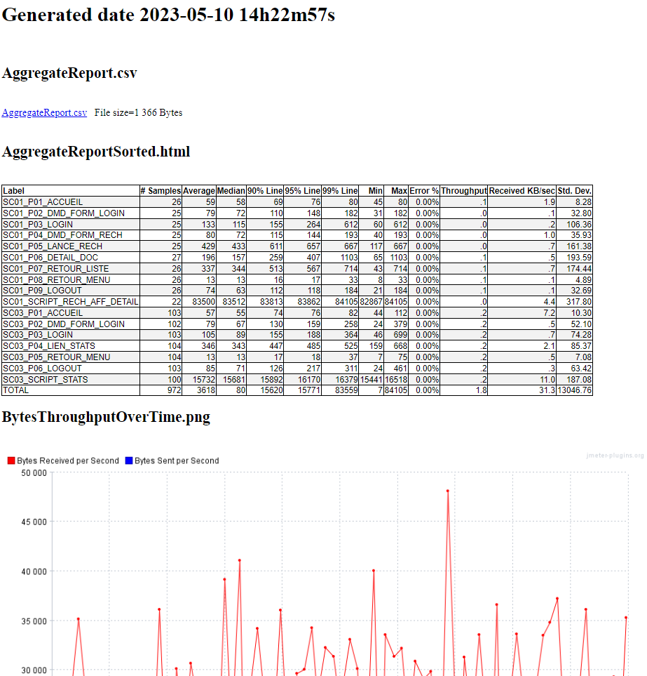

# Generating an HTML page that references or includes various files
This program recursively scans a directory looking for files of different types to generate a link or include the content in the generated html page.

The types of files searched are:
 * csv
 * gz
 * zip
 * log
 * gif
 * png
 * bmp
 * jpg
 * jpeg
 * html
 
The link is "&lt;a ref=" relative for files of type: csv, gz, zip, log (to download it)

The link is "
Example : z.img < dir/x.img < dir/y.img < aa/bb/c.img < aa/bb/d.img
Deep    : no dir, dir 1 deep level,      dir 2 deep level
</pre>

## License
See the LICENSE file Apache 2 [https://www.apache.org/licenses/LICENSE-2.0](https://www.apache.org/licenses/LICENSE-2.0)

## The index.html generated
HTML Extract example :



## Usage Maven

The maven groupId, artifactId and version, this plugin is in the **Maven Central Repository**

```xml
<groupId>io.github.vdaburon</groupId>
<artifactId>create-html-for-files-in-directory</artifactId>
<version>1.0</version>
```
Just include the plugin in your `pom.xml` and execute `mvn verify`.

```xml
<project>
    <properties>
        <graph_width>1024</graph_width>
    </properties>

    <dependencies>
        <dependency>
            <groupId>io.github.vdaburon</groupId>
            <artifactId>create-html-for-files-in-directory</artifactId>
            <version>1.0</version>
        </dependency>
    </dependencies>
    
    <build>
        <plugins>
            <plugin>
                <groupId>org.codehaus.mojo</groupId>
                <artifactId>exec-maven-plugin</artifactId>
                <version>1.2.1</version>
                <executions>
                    <execution>
                        <id>create_html_page_for_files_in_directory</id>
                        <phase>verify</phase>
                        <goals>
                            <goal>java</goal>
                        </goals>
                        <configuration>
                            <mainClass>io.github.vdaburon.jmeter.utils.HtmlGraphVisualizationGenerator</mainClass>
                            <arguments>
                                <argument>${project.build.directory}/jmeter/results</argument>
                                <argument>index.html</argument>
                            </arguments>
                            <systemProperties>
                                <systemProperty>
                                    <key>image_width</key>
                                    <value>${graph_width}</value>
                                </systemProperty>
                            </systemProperties>
                        </configuration>
                    </execution>
                </executions>
            </plugin>
        </plugins>
    </build>
</project>
```

## Simple jar tool
This tool is a java jar, so it's could be use as simple jar (look at [Release](https://github.com/vdaburon/CreateHtmlForFilesInDirectory/releases) to download jar file)
<pre>
java -cp create-html-for-files-in-directory-&lt;version&gt;.jar io.github.vdaburon.jmeter.utils.HtmlGraphVisualizationGenerator jmeter/results index.html
</pre>

## Link to others projects
Usally this plugin is use with [jmeter-graph-tool-maven-plugin](https://github.com/vdaburon/jmeter-graph-tool-maven-plugin)

and this plugin [csv-report-to-html](https://github.com/vdaburon/csv-report-to-html)

1) The **jmeter-graph-tool-maven-plugin** create the report csv files and graphs
2) The **csv-report-to-html** create the **html table report** from the csv file
3) The **create-html-for-files-in-directory** create a page html this links to images and files in a directory to show and add links

